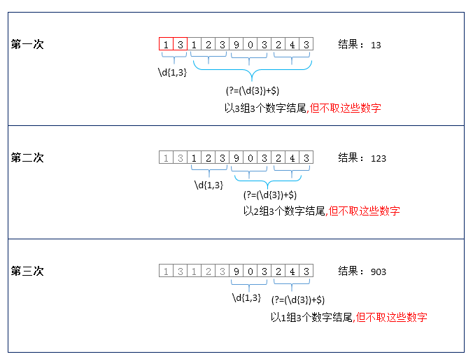

正则表达式是用来处理字符串的一个规则，作用：匹配和捕获字符串

## 正则创建方式的区别

```js
var reg=/^\d+$/; //字面量方式
var name='hello';
var reg=new RegExp("^\\d+"+name+"\\d+$") // 实例创建方式
```

1. 字面量方式中出现的一切都是元字符，所以不能进行变量值的拼接，而实例创建的方式是可以的
2. 字面量方式中写`\d`是可以的，而在是列中需要把它转义 `\\d`

## 元字符

### 量词

<style> table th:nth-child(1) { width: 120px; }table th:nth-child(2) { width: 600px; } </style>

| 字符    | 含义             |
| :------ | ---------------- |
| *       | 字符出现0到多次  |
| +       | 字符出现1到多次  |
| ？      | 字符出现0次或1次 |
| { n }   | 字符出现n次      |
| { n , } | 字符出现n到多次  |
| { n, m} | 字符出现n到m次   |

### 修饰符

<style> table th:nth-child(1) { width: 120px; }table th:nth-child(2) { width: 600px; } </style>

| 字符 | 含义       |
| :--- | ---------- |
| g    | 全局匹配   |
| i    | 忽略大小写 |
| m    | 多行匹配   |

### 特殊的元字符

<style> table th:nth-child(1) { width: 120px; }table th:nth-child(2) { width: 600px; } </style>

| 字符     | 含义                                         |
| :------- | -------------------------------------------- |
| \        | 转义字符，转义后面字符的含义                 |
| ^        | 以某字符开头                                 |
| $        | 以某字符结尾                                 |
| .        | 任意字符，除\n换行符                         |
| ( )      | 分组                                         |
| (?:)     | 只匹配不捕获                                 |
| (?=)     | 正向预查                                     |
| (?!)     | 负向预查                                     |
| [ xyz ]  | x或者y或者z                                  |
| [ ^xyz ] | 除xyz的任意字符                              |
| [ a-z ]  | a到z的任意字符                               |
| [ ^a-z ] | 除a-z的任意字符                              |
| x \| y   | x或y                                         |
| \d       | 0-9之间的数字                                |
| \D       | 除0-9之间的数字以外的任意字符                |
| \b       | 单词边界                                     |
| \B       | 非单词边界                                   |
| \w       | 数字，字母，下划线中的任意字符               |
| \W       | 非数字，字母，下划线中的任意字符             |
| \s       | 匹配一个空白字符，空格，一个制表符，换行符   |
| \S       | 匹配一个非空白字符，空格，一个制表符，换行符 |

 #### 18-65的数字

```js
var reg=/^(1[89]|[2-5]\d|6[0-5])$/;
console.log(reg.test(29));
```

#### 中国姓名

```js
var reg=/^[\u4e00-\u9fa5]{2,4}$/;
console.log(reg.test('张三'))
```


## 贪婪匹配和惰性匹配
在正则 `/\d{2,4}/` ，表示数字连续出现 2 - 4 次，可以匹配到 2 位、 3 位、4 位连续数字。   

但是在 **贪婪匹配** 如 `/\d{2,4}/g` ，会**尽可能多**匹配，如超过 4 个，就只匹配 4 个，如有 3 个，就匹配 3 位。   

而在 **惰性匹配** 如 `/\d{2,4}?/g` ，会 **尽可能少** 匹配，如超过 2 个，就只匹配 2 个，不会继续匹配下去。

```js
let r1 = /\d{2,4}/g;
let r2 = /\d{2,4}?/g;
let s  = "123 1234 12345"; 
s.match(r1); // ["123", "1234", "1234"]
s.match(r2); // ["12", "12", "34", "12", "34"]
```

| 惰性量词 | 贪婪量词 |
| :------: | :------: |
| `{m,m}?` | `{m,m}`  |
| `{m,}?`  |  `{m,}`  |
|   `??`   |   `?`    |
|   `+?`   |   `+`    |
|   `*?`   |   `*`    |

## 正则捕获

捕获的内容格式是一个数组

- 数组中的第一项是当前正则捕获的字符
- `index`:捕获内容在字符串中的开始的索引位置
- `input`:捕获的原始字符串

### 分组捕获

```js
ar reg=/^(\d{6})(\d{4})(\d{2})(\d{2})(\d{3})(\d|x)$/i;
var num='111111199608111410';
console.log(reg.exec(num)) // ["111111199608111410", "111111", "1996", "08", "11", "141", "0", index: 0, input: "111111199608111410"]
```

如果不要捕获，在分组里面加`?:`

```js
var reg=/^(\d{6})(\d{4})(\d{2})(\d{2})(?:\d{3})(\d|x)$/i;
var num='111111199608111410';
console.log(reg.exec(num)) // ["111111199608111410", "111111", "1996", "08", "11", "0", index: 0, input: "111111199608111410"]
```

### exec

正则的方法,获取正则匹配的数据，如果匹配多条数据，只会获取一条

```js
// 获取所有正则匹配的数据
var reg=/\d+/g;
let str='1111你好1222';
let res=reg.exec(str),arr=[];
while(res){
    arr.push(res[0])
    res=reg.exec(str);
}
console.log(arr); 
```

### match

字符串的方法，可以获取到所有匹配的数据

缺点：如果一个正则分组了，只能获取大正则匹配的数据

```js
var reg=/\d+/g;
let str='1111你好1222';
console.log(str.match(reg)); // [1111.1222]
```

### replace

字符串替换方法

每执行一次`replace`方法，相当于执行一次`exec()`方法，`RegExp.$1`获取第一个分组捕获的值

```js
var str='hello1hello2';
str=str.replace(/hello/g,'你好');
console.log(str) // 你好1你好2
```

`replace`可以接受一个匿名函数，函数的跟`exec`返回的数据一样

```js
var str='hello1hello2';
str=str.replace(/hello/g,function(){
	console.log(arguments)
});
```

## 坑

当正则加了修饰符`g`以后，每匹配一次，就会修改正则的`lastIndex`属性，`lastIndex`用来记录下一次匹配的开始位置，`match`方法不会出现这个问题

```js
 let reg=/(\d+)/g;
 console.log(reg.exec('dd11dd1111ff113'));
 console.log(RegExp.$1) //11  第一个
 reg.test('dd11dd1111ff113')
 reg.exec('dd11dd1111ff113');
 console.log(RegExp.$1) // 113  第三个
```

## 练习

### 去首尾空格

```js
var str="  111 222 ";
var val=str.replace(/^\s+|\s+/,'');
console.log(val)
```


### 获取url参数

```js
var str = "http://kbs.sports.qq.com/kbsweb/game.html?mid=100000&cid=1467086&app=1.0";
var reg=/([^?=&]+)=([^?=&]+)/g; // =左右两边的值 不能包括？ = &
var obj={};
str.replace(reg,function(){
	return obj[arguments[1]]=arguments[2];
})
console.log(obj) // {mid: "100000", cid: "1467086", app: "1.0"}
```

### 单词首字母替换成大写字母

```js
var str = "huahua loves eating bums";
var reg=/(?:^|\s)[a-z]/g; // 匹配以字母开头 或者以空格开头的字符
var newStr=str.replace(reg,function(){
	return arguments[0].toUpperCase();
})
console.log(newStr)
```

### 模板引擎的初步原理

`"my name is {0},my age is {1},i come from {2},i love {3}~~"`,然后将数组对应项一一放进去`["一问", 28, "湖南", "js"]`,然后得到完整的句子

```js
var str = "my name is {0},my age is {1},i come from {2},i love {3}~~";
  var arr = ["huahua", 28, "beijing", "js"];
  var newStr = str.replace(/{(\d)}/g,function  () {
      var index = arguments[1];
      return arr[index];
  })
  console.log(newStr); 
// my name is huahua,my age is 28,i come from beijing,i love js~~
```


### 日期转换

日期格式的转换: "2015-9-22 13:10:0" -> 2015年09月22日 13时10分00秒

```js
// 引用模板思路,先上一个模板,然后将模板中对应的位置替换掉就可以了
  // 而对于"2015-9-22 13:10:0",需要提取出年月日时分秒,用正则捕获即可,得到的是数组
  // {0}=>2015,而2015存在捕获的数组里,将其索引和0建立关系即可
  // [{0},{1}...]和[2015,9]一一对应即可,相当于遍历前面的数组将值一一换成后面数组的值
  var model = "{0}年{1}月{2}日 {3}时{4}分{5}秒";
  var timeStr = "2015-9-22 13:10:0";
  var arr = /(\d{4})[-/](\d{1,2})[-/](\d{1,2}) (\d{1,2}):(\d{1,2}):(\d{1,2})/.exec(timeStr);
  // ["2015-9-22 13:10:0", "2015", "9", "22", "13", "10", "0", index: 0, input: "2015-9-22 13:10:0"]
  console.log　(arr);
  // 将 "1"=>"01",一位数字通过加零变成两位数字
  function oneBitFormatTwoBit(str) {
    return str.length === 1 ? "0" + str : str;
  }
  var newStr = model.replace(/{(\d+)}/g, function() {　　
    console.log(arguments)
    // 拿第一次遍历举例,,arguments是["{0}", "0", 0, "{0}年{1}月{2}日 {3}时{4}分{5}秒"]
    // 返回的值肯定是2015,而2015是arr[1],arguments[1]的值是"0",换言之,2015就是arr[+arguments[1] + 1],"0"是字符串需要转换成数字
    // 结果的长度若是一位需要转换成两位
    return oneBitFormatTwoBit(arr[+arguments[1] + 1])

  })
  console.log(newStr);
  // 2015年09月22日 13时10分00秒	
```

### 千分位

```js
// js写法
let num='156325545';
num=num.split('').reverse().join('');
for(let i=2;i<num.length-1;i+=4){
    let prev=num.substring(0,i+1);
    let next=num.substring(i+1);
    num=prev+','+next;
}
num=num.split('').reverse().join('');
console.log(num)
```

正则实现：

```js
function format (num) {  
    var reg=/\d{1,3}(?=(\d{3})+$)/g;   
    return (num + '').replace(reg, '$&,');  
}
```

**解释**

- 正则表达式 `\d{1,3}(?=(\d{3})+$)`  表示前面有`1~3`个数字，后面的至少由一组3个数字结尾
- `?=`表示正向引用，可以作为匹配的条件，但匹配到的内容不获取，并且作为下一次查询的开始
- `$&` 表示与正则表达式相匹配的内容，具体的可查看 [w3school的replace()方法](http://www.w3school.com.cn/jsref/jsref_replace.asp)

**运行的过程看下图**

假如有数字`13123903243`，则正则表达式查找与替换的过程，如下图所示

