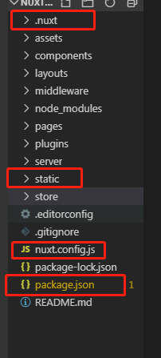

项目做好后，执行`npm run build`，将图中的文件传到服务器中




更改`package.json`文件

```json
{
  "name": "nuxt",
  "version": "1.0.0",
  "description": "My impeccable Nuxt.js project",
  "author": "liuli",
  "private": true,
  "scripts": {
    "dev": "nuxt",
    "build": "nuxt build",
    "start": "nuxt start",
    "generate": "nuxt generate"
  },
  "dependencies": {
    "@nuxtjs/axios": "^5.3.6",
    "cross-env": "^5.2.0",
    "element-ui": "^2.4.11",
    "nuxt": "^2.4.0",
    "vuex-persist": "^2.2.0"
  },
  "devDependencies": {
    "eslint-config-prettier": "^4.1.0",
    "eslint-plugin-prettier": "^3.0.1",
    "nodemon": "^1.18.9",
    "prettier": "^1.16.4"
  },
  "config":{  // 添加此配置
    "nuxt":{
      "host":"0.0.0.0", 
      "port":"3000"
    }
  }
}

```

使用`pm2`运行：

```bash
pm2 start npm --name "nuxt" -- run start
```

`pm2`其他命令

```js
pm2 list  // 查看任务列表
pm2 stop app_name|app_id  // 停止指定name或者id的任务
pm2 stop all  // 停止所有任务
pm2 delete app_name|app_id  // 删除指定name或者id的任务
pm2 delete all  // 删除所有任务
pm2 logs // 查看日志
pm2 kill  // 杀死pm2进程
pm2 restart all // 重启所有应用
```


