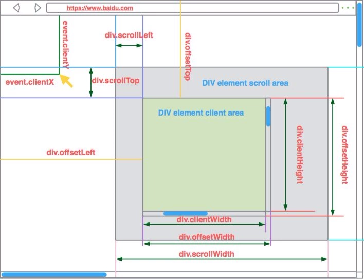
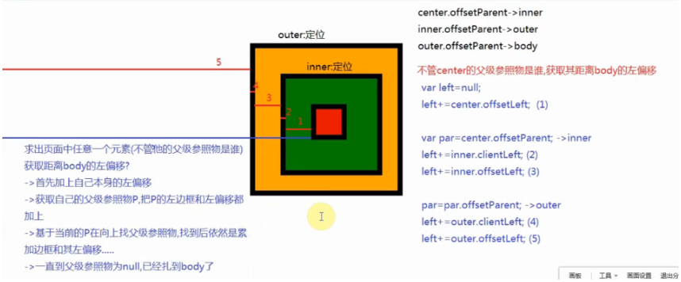

指的是通过`js`中提供的一系列的属性和方法，获取页面中元素的样式信息值

`#box`有很多自己的私有属性：

`HTMLDivElement.prototype`->`HTMLElement.prototype`->`Element.prototype`->`Node.prototype`->`EventTarget.prototype`->`Object.prototype`

```js
var box = document.getElementById("box");
console.dir(box);
```
## 概念
### 内容的宽度和高度

我们设置的`width/height`这两个样式就是内容的宽和高；

● 如果没有设置`height`值，容器的高度会根据里面内容自适应，这样获取的值就是真实内容的高；

● 如果设置了固定的高度，不管内容是多还是少，其实我们内容的高度值的都是设定的那个值。

###  真实内容的宽度和高度

代指的是实际内容的宽高（和我们设置的`height`没有必然的联系），如我设置高度为`200`,如果内容有溢出，那么真实内容的高度是要把溢出内容的高度也加进来的。



## client系列

### clientWidth/clientHeight

`clientWidth/clientHeight`:内容的宽度/高度+左右/上下`padding`

### clientLeft

`clientLeft`:左边框的宽度

### clientTop

`clientTop`:上边框的高度


## offset系列



### offsetWidth/offsetHeight

`offsetWidth/offsetHeight`：内容的宽度/高度+左右/上下`padding`+左右/上下`border`

### offsetParent

当前元素的父级参照物，在同一个平面中，最外层的元素是里面所有元素的父级参照物（和`html`层级结构没有必然的联系）

### offsetLeft/offsetTop

当前元素（外边框）距离其父级参照物（内边框）的偏移距离

### offset封装

```js
function offset(curEle){
	var totalLeft = null,totalTop = null,par = curEle.offsetParent;
	// 首先把自己本身的进行累加：
	totalLeft += curEle.offsetLeft;
	totalTop += curEle.offsetTop;
 
	// 只要没有找到body，我们就把父级参照物的边框和偏移进行累加
	while (par){
		if(navigator.userAgent.indexOf("MSIE 8.0") === -1){ //不是标准ie8浏览器才累加边框
			// 累加父级参照物的边框
			totalLeft += par.clientLeft;
			totalTop += par.clientTop;
		}		
 
		// 累加父级参照物的偏移
		totalLeft += par.offsetLeft;
		totalTop += par.offsetTop;
 
		par = par.offsetParent;
	}
	return {left:totalLeft,top:totalTop};
}

```


## scroll系列

### scrollWidth/scrollHeight

● 容器中内容没有溢出的情况下：和我们的`clientWidth/clientHeight`一模一样

● 如果容器中内容有溢出，获取的结果如下规则：

` scrollWidth`：真实内容的宽度（包含溢出）+左填充

` scrollHeigh`t：真实内容的高度（包含溢出）+上填充

获取到的结果都是“约等于”的值，因为：

● 同一个浏览器，我们是否设置`overflow="hidden"`，对于最终的结果是有影响的（滚动条也占据宽度会影响）；

● 在不同的浏览器中我们获取到的结果也是不相同的

### scrollLeft/scrollTop

滚动条卷去的内容宽度/高度

## 关于js盒子模型属性取值的问题

我们通过以上这些属性值获取的结果永远不可能出现小数，都是整数；

浏览器获取结果的时候，会在原来真实结果的基础上进行四舍五入。

## DOM0和DOM2的区别

1. 机制不一样

   - `DOM0`采用的是给私有变量赋值，所以只能绑定一个方法

   - `DOM2`采用事件池机制，所以能绑定多个不同的方法

2. 移除的操作

   - `DOM2`在移除的时候，必须清楚要移除哪一个方法,才能在事件池中移除掉

3. `DOM2`事件绑定了一些`DOM0`无法操作的事件行为，例如：`DOMcontentLoad`事件


## 注意

● 不管哪些属性，也不管是什么浏览器，也不管是获取还是设置，想要都兼容的话，需要写两套;

● 且必须`document.documentElement`在前

```javascript
document.documentElement[attr] || document.body[attr];
```