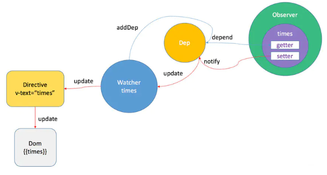

## 特点
`vue`的响应式，对象是通过`Object.defineProperty`来实现响应式的,监听对象的`get`和`set`，数组是重写原型方法，实现响应式。

```js
var data = { name: 'yck' }
observe(data)
let name = data.name // -> get value
data.name = 'yyy' // -> change value
 
function observe(obj) {
  // 判断类型
  if (!obj || typeof obj !== 'object') {
    return
  }
  Object.keys(obj).forEach(key => {
    defineReactive(obj, key, obj[key])
  })
}
 
function defineReactive(obj, key, val) {
  // 递归子属性
  observe(val)
  Object.defineProperty(obj, key, {
    // 可枚举
    enumerable: true,
    // 可配置
    configurable: true,
    // 自定义函数
    get: function reactiveGetter() {
      console.log('get value')
      return val
    },
    set: function reactiveSetter(newVal) {
      console.log('change value')
      val = newVal
    }
  })
}
```


以上代码简单的实现了如何监听数据的 set 和 get 的事件，但是仅仅如此是不够的，因为自定义的函数一开始是不会执行的。只有先执行了依赖收集，才能在属性更新的时候派发更新，所以接下来我们需要先触发依赖收集。

```js
<div>{{name}}</div>
```

在解析如上模板代码时，遇到 `{{name}}` 就会进行依赖收集。

接下来我们先来实现一个 `Dep` 类，用于解耦属性的依赖收集和派发更新操作。

## 实现Dep

```js
// 通过 Dep 解耦属性的依赖和更新操作
class Dep {
  constructor() {
    this.subs = []
  }
  // 添加依赖
  addSub(sub) {
    this.subs.push(sub)
  }
  // 更新
  notify() {
    this.subs.forEach(sub => {
      sub.update()
    })
  }
}
// 全局属性，通过该属性配置 Watcher
Dep.target = null
```

以上的代码实现很简单，当需要依赖收集的时候调用 `addSub`，当需要派发更新的时候调用 `notify`。

接下来我们先来简单的了解下` Vue` 组件挂载时添加响应式的过程。在组件挂载时，会先对所有需要的属性调用 `Object.defineProperty()`，然后实例化` Watcher`，传入组件更新的回调。在实例化过程中，会对模板中的属性进行求值，触发依赖收集。

## 实现Watcher

```js
class Watcher {
  constructor(obj, key, cb) {
    // 将 Dep.target 指向自己
    // 然后触发属性的 getter 添加监听
    // 最后将 Dep.target 置空
    Dep.target = this
    this.cb = cb
    this.obj = obj
    this.key = key
    this.value = obj[key]
    Dep.target = null
  }
  update() {
    // 获得新值
    this.value = this.obj[this.key]
    // 调用 update 方法更新 Dom
    this.cb(this.value)
  }
}
```


以上就是 `Watcher `的简单实现，在执行构造函数的时候将 `Dep.target` 指向自身，从而使得收集到了对应的 `Watcher`，在派发更新的时候取出对应的 `Watcher` 然后执行 `update `函数。

 接下来，需要对 `defineReactive` 函数进行改造，在自定义函数中添加依赖收集和派发更新相关的代码。 

## 改造代码

```js
function defineReactive(obj, key, val) {
  // 递归子属性
  observe(val)
  let dp = new Dep()
  Object.defineProperty(obj, key, {
    enumerable: true,
    configurable: true,
    get: function reactiveGetter() {
      console.log('get value')
      // 将 Watcher 添加到订阅
      if (Dep.target) {
        dp.addSub(Dep.target)
      }
      return val
    },
    set: function reactiveSetter(newVal) {
      console.log('change value')
      val = newVal
      // 执行 watcher 的 update 方法
      dp.notify()
    }
  })
}
```

以上所有代码实现了一个简易的数据响应式，核心思路就是手动触发一次属性的 `getter` 来实现依赖收集。

现在我们就来测试下代码的效果，只需要把所有的代码复制到浏览器中执行，就会发现页面的内容全部被替换了。

```js
var data = { name: 'yck' }
observe(data)
function update(value) {
  document.querySelector('div').innerText = value
}
// 模拟解析到 `{{name}}` 触发的操作
new Watcher(data, 'name', update)
// update Dom innerText
data.name = 'yyy'
```

## Object.defineProperty 的缺陷

- 如果通过下标方式修改数组数据或者给对象新增属性并不会触发组件的重新渲染，因为 `Object.defineProperty` 不能拦截到这些操作，更精确的来说，对于数组而言，大部分操作都是拦截不到的，只是 `Vue` 内部通过重写函数的方式解决了这个问题。 

```js
export function set (target: Array<any> | Object, key: any, val: any): any {
  // 判断是否为数组且下标是否有效
  if (Array.isArray(target) && isValidArrayIndex(key)) {
    // 调用 splice 函数触发派发更新
    // 该函数已被重写
    target.length = Math.max(target.length, key)
    target.splice(key, 1, val)
    return val
  }
  // 判断 key 是否已经存在
  if (key in target && !(key in Object.prototype)) {
    target[key] = val
    return val
  }
  const ob = (target: any).__ob__
  // 如果对象不是响应式对象，就赋值返回
  if (!ob) {
    target[key] = val
    return val
  }
  // 进行双向绑定
  defineReactive(ob.value, key, val)
  // 手动派发更新
  ob.dep.notify()
  return val
}
```

 对于数组而言，`Vue` 内部重写了以下函数实现派发更新 

## 数组实现响应式

```js
// 获得数组原型
const arrayProto = Array.prototype
export const arrayMethods = Object.create(arrayProto)
// 重写以下函数
const methodsToPatch = [
  'push',
  'pop',
  'shift',
  'unshift',
  'splice',
  'sort',
  'reverse'
]
methodsToPatch.forEach(function (method) {
  // 缓存原生函数
  const original = arrayProto[method]
  // 重写函数
  def(arrayMethods, method, function mutator (...args) {
  // 先调用原生函数获得结果
    const result = original.apply(this, args)
    const ob = this.__ob__
    let inserted
    // 调用以下几个函数时，监听新数据
    switch (method) {
      case 'push':
      case 'unshift':
        inserted = args
        break
      case 'splice':
        inserted = args.slice(2)
        break
    }
    if (inserted) ob.observeArray(inserted)
    // 手动派发更新
    ob.dep.notify()
    return result
  })
})
```

## proxy的优缺点

### 优点

`Vue3.0` 要使用 `Proxy `替换原本的 `API` 原因在于 `Proxy` 无需一层层递归为每个属性添加代理，一次即可完成以上操作，性能上更好，并且原本的实现有一些数据更新不能监听到，

### 缺点

兼容性不好


## 总结

其实在 **Vue** 中初始化渲染时，视图上绑定的数据就会实例化一个 **Watcher**，依赖收集就是是通过属性的 **getter** 函数完成的，文章一开始讲到的 **Observer** 、**Watcher** 、**Dep** 都与依赖收集相关。其中 **Observer** 与 **Dep** 是一对一的关系， **Dep** 与 **Watcher** 是多对多的关系，**Dep** 则是 **Observer** 和 **Watcher** 之间的纽带。依赖收集完成后，当属性变化会执行被 **Observer** 对象的 **dep.notify()** 方法，这个方法会遍历订阅者（Watcher）列表向其发送消息， **Watcher** 会执行 **run** 方法去更新视图，我们再来看一张图总结一下：



1. 在 **Vue** 中模板编译过程中的指令或者数据绑定都会实例化一个 **Watcher** 实例，实例化过程中会触发 **get()** 将自身指向 **Dep.target**;
2. data在 **Observer** 时执行 **getter** 会触发 **dep.depend()** 进行依赖收集;依赖收集的结果：
   - data在 **Observer** 时闭包的dep实例的subs添加观察它的 **Watcher** 实例；
   -  **Watcher** 的deps中添加观察对象 **Observer** 时的闭包dep；
3. 当data中被 **Observer** 的某个对象值变化后，触发subs中观察它的watcher执行 **update()** 方法，最后实际上是调用watcher的回调函数cb，进而更新视图。