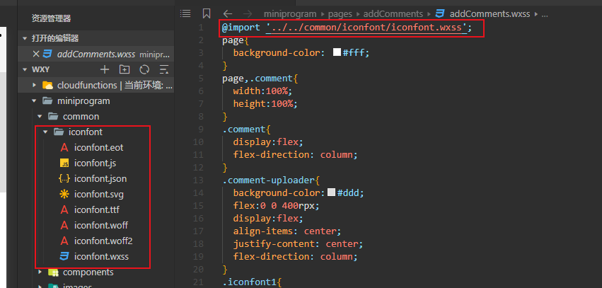

## 微信小程序中使用iconfont

在`iconfont`官网，下载文件，新建文件存放，将`css`改成`wxss`文件，在`wcss`文件中引用




## 微信小程序中的组件

### 不要在observer中修改自身属性，会造成内存泄漏

```js
properties: {
    index:{
      type: Number,
      observer:function(newVal, oldVal, changedPath){
        if (newVal < 10) {
          this.setData({
            _index: '0' + newVal  // 注意点
          })
        }
      }
    }
  },
```

